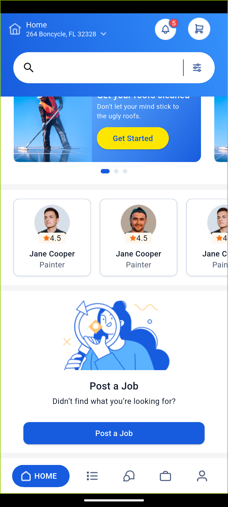
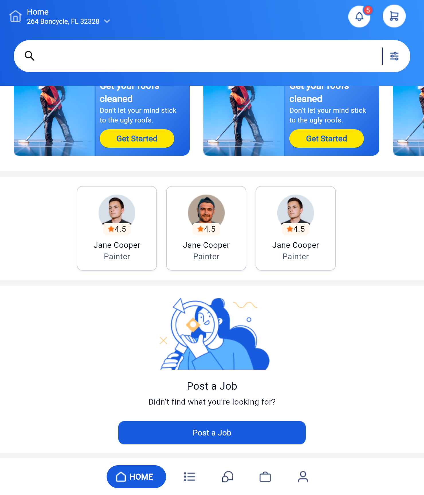

# flutter_intern_test_assignment

1. This flutter project is created using latest flutter version and Android(Meerkat Feature Drop) version.
2. Designed on Pixel 8 emulator with API 34 "UpsideDownCake" Android 14.
3. Made responsive for several devices and also made responsive for table view.

### Mobile View
  &ensp;&ensp; 

### Tablet View
  &ensp;&ensp; 

